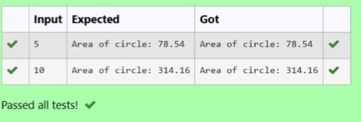

# Classes and Objects in Python: Calculate the Area of a Circle

## 🎯 Aim
To write a Python program that calculates the **area of a circle** based on the radius provided by the user. This program uses a class named `cse` and a method `mech` to perform the calculation.

## 🧠 Algorithm
1. **Get user input**: Take the radius of the circle as input from the user.
2. **Define the class**: Create a class named `cse`.
3. **Define the method**: Inside the class, define the method `mech` to calculate the area of the circle using the formula:  
   Area = pi *r^2 
4. **Execute the program**: Create an object of the class and call the method with the radius value.

## 🧾 Program
```
import math
class Saveetha:
    def __init__(self, r):
        self.area = math.pi * (r ** 2) 
    def slot(self):
        print("Area of circle:", round(self.area, 2))
r = float(input())
res = Saveetha(r)  
res.slot()
```
## Output


## Result
A Python program that calculates the **area of a circle** based on the radius provided by the user. This program uses a class named `cse` and a method `mech` to perform the calculation was completed successfully and output was generated.
